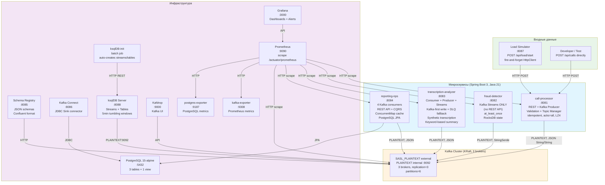
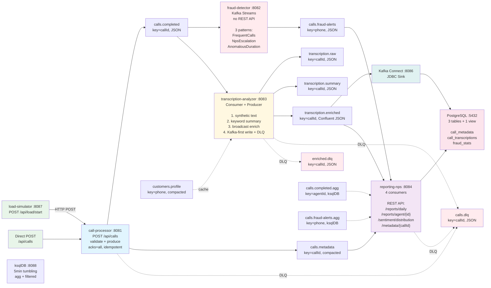

# Architecture & Data Flow Diagrams

> **Source of truth:** actual source code (`src/main/java/`), `docker-compose.yml`, `init-topics.sh`.
> All topic names, ports, endpoints, and data flows verified against implementation.

---

## 1. Container Architecture (C4 Level 2)

### Profiles (docker-compose.yml)

| Profile | What's included |
|---------|----------------|
| **`full`** | ALL: Kafka cluster + 5 services + PostgreSQL + Schema Registry + Kafka Connect + ksqlDB + Prometheus + Grafana + Kafdrop + exporters |
| **`core`** | Kafka + 4 services (no load-simulator) + PostgreSQL + Schema Registry + Kafka Connect + ksqlDB |
| **`load-test`** | Kafka + PostgreSQL + load-simulator + monitoring stack |
| **`monitoring`** | Prometheus + Grafana + Kafdrop + kafka-exporter + postgres-exporter |

---

## 2. Data Flow

---

## 3. Topic Reference (verified from `init-topics.sh`)

| Topic | Type | Key | Format | Replication | Partitions | Retention | Producer | Consumer(s) |
|-------|------|-----|--------|-------------|------------|-----------|----------|-------------|
| `calls.completed` | Stream | `callId` | JSON String/String | 3 | 6 | 7 days | call-processor | fraud-detector, transcription-analyzer |
| `calls.metadata` | Compacted Table | `callId` | JSON String/String | 3 | 6 | 30 days | call-processor | reporting-nps |
| `calls.fraud-alerts` | Stream | `phone` | JSON String/String | 3 | 6 | default | fraud-detector | reporting-nps |
| `transcription.raw` | Stream | `callId` | JSON String/String | 3 | 6 | default | transcription-analyzer | summary-processor (internal) |
| `transcription.summary` | Stream | `callId` | JSON String/String | 3 | 6 | default | transcription-analyzer | enrichment-processor (internal) |
| `transcription.enriched` | Stream | `callId` | Confluent JSON | 3 | 6 | default | transcription-analyzer | reporting-nps, Kafka Connect |
| `calls.dlq` | Stream | `callId` | JSON String/String | 3 | 6 | 30 days | all services | — |
| `transcription.enriched.dlq` | Stream | `callId` | JSON String/String | 3 | 3 | default | transcription-analyzer | — |
| `customers.profile` | Compacted Table | `phone` | JSON String/String | 3 | 6 | default | bootstrap script | transcription-analyzer |
| `calls.completed.agg` | Stream | `agentId` | JSON String/String | 3 | 6 | default | ksqlDB | reporting-nps (optional) |
| `calls.fraud-alerts.agg` | Stream | `phone` | JSON String/String | 3 | 6 | default | ksqlDB | reporting-nps (optional) |

---

## 4. Key Implementation Details (from source code)

### Serialization
- **All topics:** `StringSerializer` / `StringDeserializer` (JSON payload as string)
- **transcription.enriched:** Confluent JSON format (`{"schema": {...}, "payload": {...}}`) — resolved via Schema Registry

### Fraud Detection Patterns (fraud-detector)
| Pattern | Logic | Threshold | Severity |
|---------|-------|-----------|----------|
| FREQUENT_CALLS | Hopping window 60s/10s, count by phone | >5 calls/window | MEDIUM |
| NPS_ESCALATION | Processor API + RocksDB KeyValueStore, 3x NPS<2 in 24h | 3 negative NPS / 24h | HIGH |
| ANOMALOUS_DURATION | Filter: duration > 300s | >300 seconds | LOW |

### Transcription Generation (transcription-analyzer)
- **No LLM** — keyword-based heuristic via `SummaryGenerator.java`
- Synthetic text: ~150 words/min, configurable
- Keyword mapping: `fraud/unauthorized/stolen` → problem=fraud_suspected, urgency=critical
- Broadcast enrichment: `CustomerProfileConsumer` + `ConcurrentHashMap` (key mismatch: summary key=callId, profile key=phone → cannot use KTable join)

### Dual Writer (transcription-analyzer)
1. Write to Kafka (`transcription.enriched`) in Confluent JSON format — primary output
2. On Kafka failure → write to `transcription.enriched.dlq` (DLQ fallback)
3. PostgreSQL writes handled exclusively by Kafka Connect JDBC Sink (not direct JDBC from service)

### PostgreSQL Schema (from `init-db.sql`)
| Table | Columns | Key Fields |
|-------|---------|------------|
| `call_metadata` | 21 | call_id PK, customer_phone, agent_id, call_duration, call_status, segment, risk_level, priority, sentiment... |
| `call_transcriptions` | 20 | transcription_id PK, call_id FK UNIQUE, transcription_text, problem, solution, sentiment, urgency, confidence... |
| `fraud_stats` | 9 | phone, call_id, pattern, severity, count, last_alert_at, agent_id |
| `v_full_call_info` | view | LEFT JOIN call_metadata + call_transcriptions |
