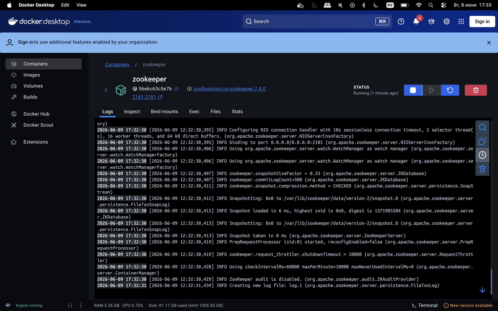
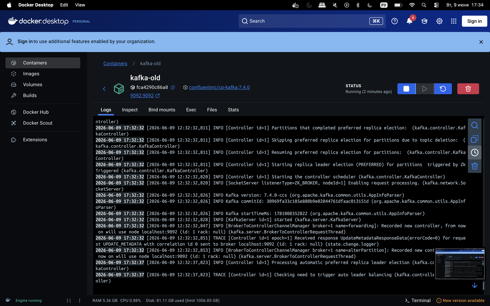
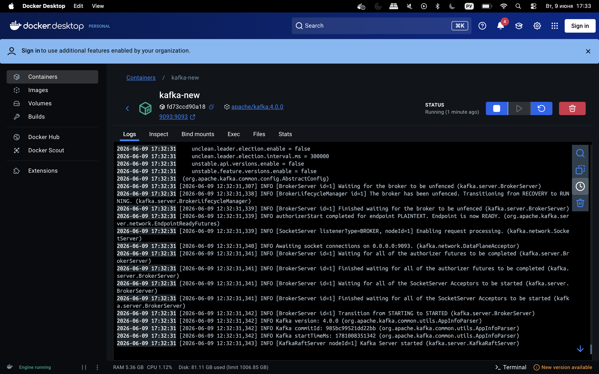
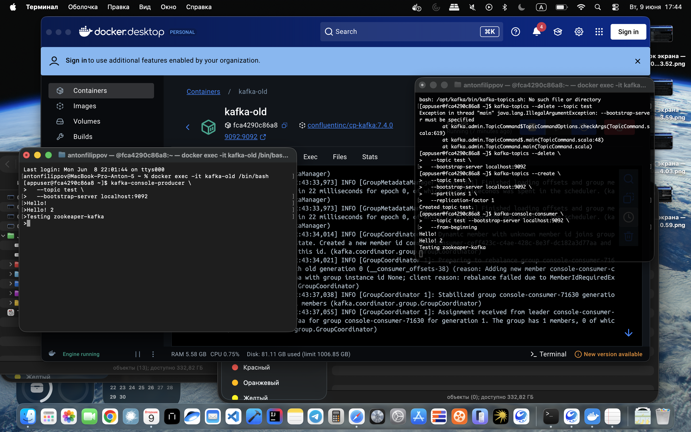
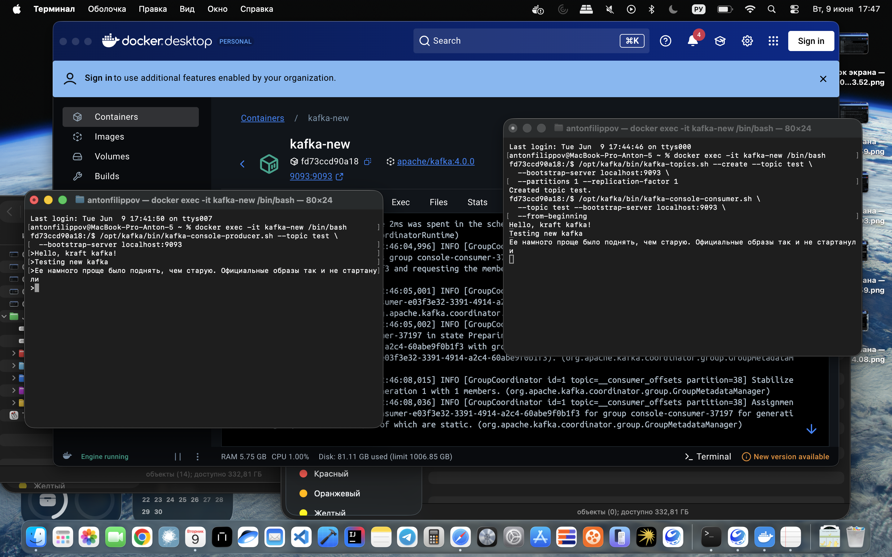

# Домашнее задание №1

Задание:

Запуск Kafka
Цель:
Научиться самостоятельно запускать Kafka (быстрый старт).

Описание/Пошаговая инструкция выполнения домашнего задания:
Самостоятельно запустить Kafka по предложенному алгоритму:

- Установить Java JDK
- Скачать Kafka с сайта kafka.apache.org и развернуть на локальном диске
- Запустить Zookeeper
- Запустить Kafka Broker
- Создать топик test
- Записать несколько сообщений в топик
- Прочитать сообщения из топика

> **Примечание:** Вместо локального запуска в этом решении использован Docker через docker-compose для упрощения настройки и воспроизводимости окружения.

## Деплоймент с Docker

### Запуск окружения

```bash
# Запустить оба контейнера в фоновом режиме
docker-compose up -d
```




### Остановка окружения

```bash
docker-compose down
```

### Структура docker-compose.yml

- **zookeeper** — контейнер с Zookeeper (порт 2181) для старой версии Kafka
- **kafka-old** — Kafka 7.4.0 на базе Zookeeper (порт 9092)
- **kafka-new** — Kafka 4.0.0 в режиме KRaft без Zookeeper (порт 9093)

## Выполнение задания

### Действия для старой Kafka (с Zookeeper)

```bash
docker exec -it kafka-old /bin/bash
```
```bash
# Создать топик test
kafka-topics --create \
  --topic test \
  --bootstrap-server localhost:9092 \
  --partitions 1 \
  --replication-factor 1

# Записать сообщения
kafka-console-producer \
  --topic test \
  --bootstrap-server localhost:9092

# Прочитать сообщения (в отдельном терминале)
kafka-console-consumer \
  --topic test \
  --bootstrap-server localhost:9092 \
  --from-beginning

# Удалить топик test
kafka-topics --delete \
  --topic test \
  --bootstrap-server localhost:9092
```



### Действия с новой Kafka (KRaft)

```bash
# Открыть shell в контейнере новой Kafka
docker exec -it kafka-new /bin/bash
```

```bash
# Внутри контейнера выполнить:

# Создать топик test
/opt/kafka/bin/kafka-topics.sh --create --topic test \
  --bootstrap-server localhost:9093 \
  --partitions 1 --replication-factor 1

# Записать сообщения (после ввода каждой строки нажимайте Enter)
/opt/kafka/bin/kafka-console-producer.sh --topic test \
  --bootstrap-server localhost:9093
> Сообщение 1
> Сообщение 2
> Сообщение 3
# Нажмите Ctrl+C для выхода

# Прочитать сообщения в отдельном терминале
/opt/kafka/bin/kafka-console-consumer.sh \
  --topic test \
  --bootstrap-server localhost:9093 \
  --from-beginning
  
# Удалить топик test
/opt/kafka/bin/kafka-topics.sh --delete --topic test \
  --bootstrap-server localhost:9093
```

