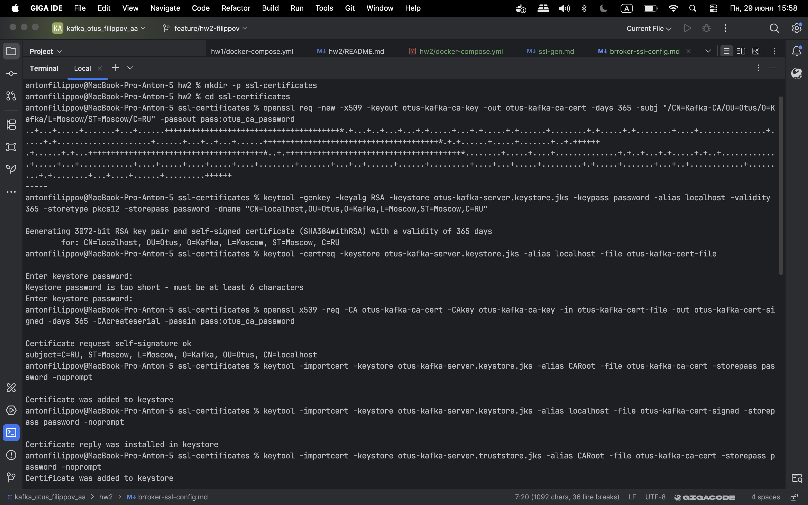
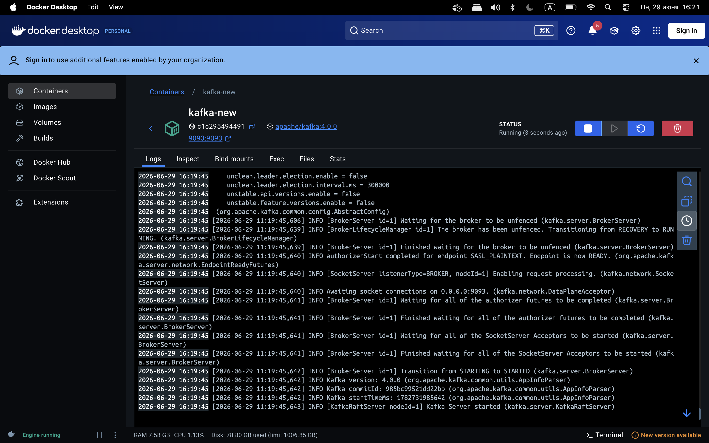
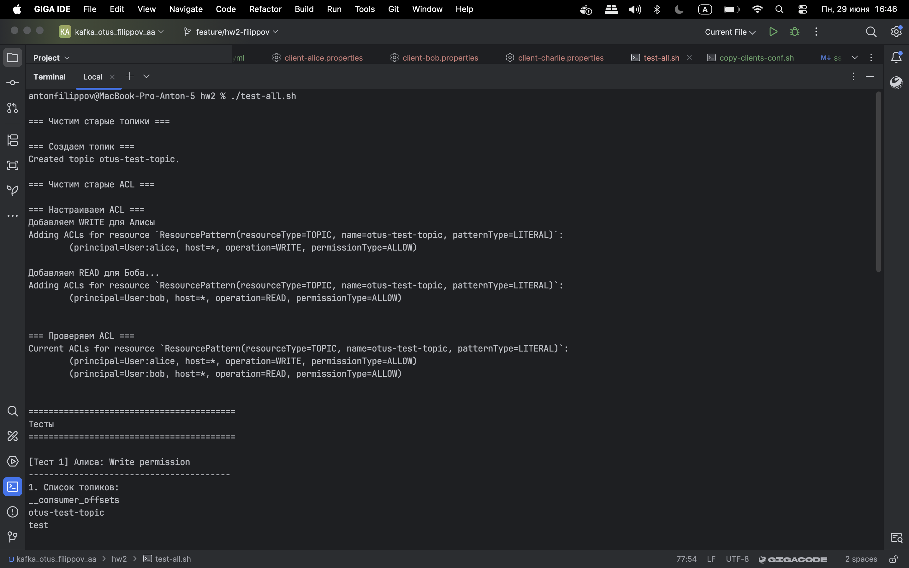
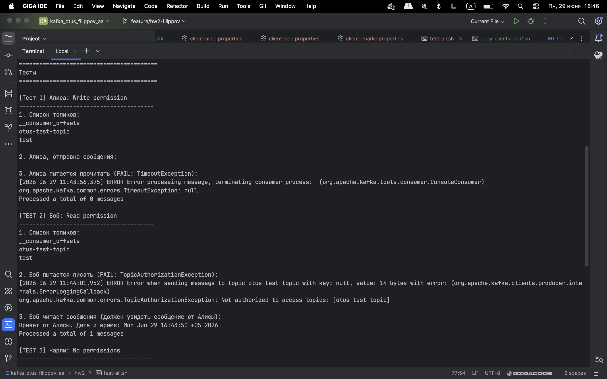
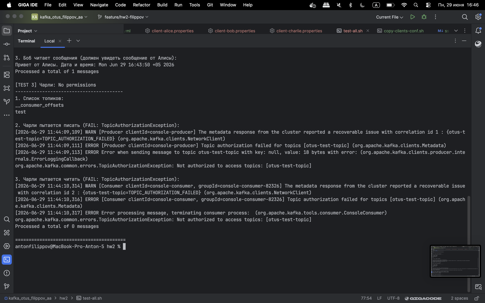

# Домашнее задание №2

**KRaft и Kafka. Настройка безопасности**

## Цель

Научиться разворачивать Kafka с помощью KRaft и самостоятельно настраивать безопасность.

---

## Задание

### Основное задание

1. **Запустить Kafka с KRaft:**
    - Сгенерировать UUID кластера
    - Отформатировать папки для журналов
    - Запустить брокер

2. **Настроить аутентификацию SASL/PLAIN:**
    - Создать трёх пользователей с произвольными именами

3. **Настроить авторизацию:**
    - Создать топик
    - Первому пользователю выдать права на **запись** в этот топик
    - Второму пользователю выдать права на **чтение** этого топика
    - Третьему пользователю **не выдавать** никаких прав на этот топик

4. **От имени каждого пользователя выполнить команды:**
    - Получить список топиков
    - Записать сообщения в топик
    - Прочитать сообщения из топика

### Дополнительное задание

Настроить SSL-шифрование для дополнительной безопасности.

---

## Ресурсы

| Ресурс                                                                        | Описание                                  |
|-------------------------------------------------------------------------------|-------------------------------------------|
| [Скрипты создания сертификатов](ssl-gen.md)                                   | Скрипты для генерации SSL-сертификатов    |
| [Создание сертификатов в терминале](screenshots/cert-generation-terminal.png) | Скриншот генерации сертификатов           |
| [SSL-сертификаты](ssl-certificates)                                           | Каталог с созданными сертификатами        |
| [JAAS конфиг](otus-kafka_server_jaas.conf)                                    | Конфигурация JAAS для Kafka               |
| [docker-compose](docker-compose.yml)                                          | Docker-конфигурация окружения             |
| [Конфиг Алисы](client-alice.properties)                                       | Конфигурация пользователя: Алиса          |
| [Конфиг Боба](client-bob.properties)                                          | Конфигурация пользователя: Боб            |
| [Конфиг Чарли](client-charlie.properties)                                     | Конфигурация пользователя: Чарли          |
| [Скрипт тестирования](test-all.sh)                                            | Скрипт для проверки настроек безопасности |

---

## Результаты тестирования

### Создаем сертификаты
[Скрипты создания сертификатов](ssl-gen.md)

### Подняли kafka в локальном docker

## Запускаем тесты

[Тестовый скрипт](test-all.sh)

### Часть 1

### Часть 2

### Часть 3

---
